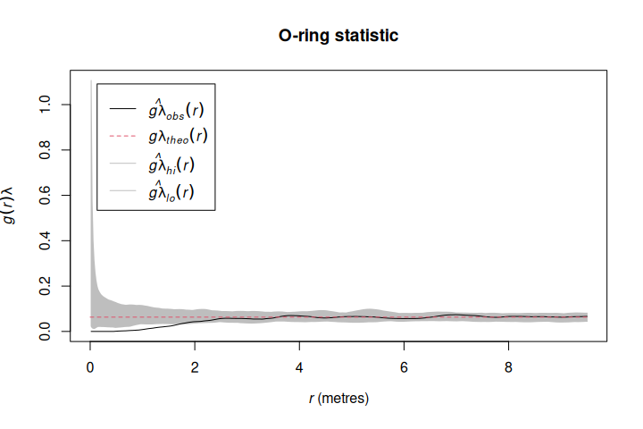
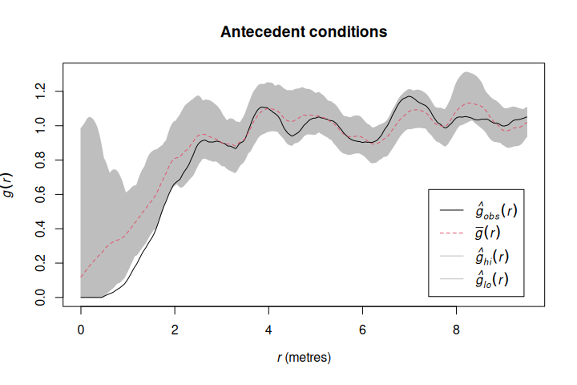
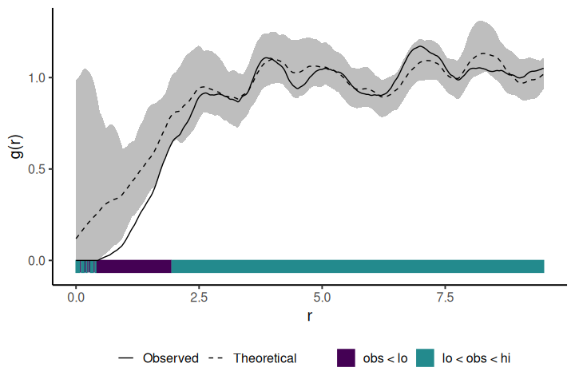

<!-- README.md is generated from README.Rmd. Please edit that file -->

# onpoint

<!-- badges: start -->

[](https://www.repostatus.org/#active)
[](https://www.tidyverse.org/lifecycle/#stable)
[](https://github.com/r-spatialecology/onpoint/actions/workflows/R-CMD-check.yaml)
[](https://codecov.io/gh/r-spatialecology/onpoint)
[](https://CRAN.R-project.org/package=onpoint)
[](https://www.gnu.org/licenses/gpl-3.0)

<!-- badges: end -->

`onpoint` is a growing collection of helper functions mainly related to
point pattern analysis and the [spatstat](http://spatstat.org/) package.

## Installation

You can install the released version of `onpoint` from CRAN with:

``` r
install.packages("onpoint")
```

You can install the development version of `onpoint` from
[Github](https://github.com/r-spatialecology/onpoint) with:

``` r
remotes::install_github("r-spatialecology/onpoint")
```

``` r
library(onpoint)
library(spatstat.core)
library(spatstat.data)

data(spruces)
```

### Summary functions

Currently, `onpoint` provides three second-order summary functions,
namely Besag’s L-function centered to zero and the O-ring statistic and
a fast estimation of the pair-correlation function.

Centering Besag’s L-function to zero has the advantage of an easier
interpretation and plotting (Haase 1995). The function
`center_l_function()` can either deal with a point pattern and
calculated the centered L-function directly, or center the L-function
afterwards it was calculating using `spatstat`s `Lest()`.

``` r
# calculate L-function
l_function <- Lest(spruces, correction = "Ripley")

# center L-function to zero
# center_l_function <- center_l_function(l_function)
l_function_centered <- center_l_function(spruces, correction = "Ripley")
```


The O-ring statistic O(r) (Wiegand & Moloney 2004) can be calculated
using `estimate_o_ring()`. Generally speaking, O(r) scales the pair
correlation g(r) function with help of the intensity . One advantage of
the O-ring statistic is that it can be interpreted as a neighborhood
density because it is a probability density function (Wiegand & Moloney
2004).

``` r
o_ring <- estimate_o_ring(spruces)
```

Of course, both summary functions can be used in combination with
`spatstat`’s `envelope()` function.

``` r
oring_envelope <- envelope(spruces, fun = estimate_o_ring, nsim = 199, verbose = FALSE)
```



`estimate_pcf_fast()` estimates the pair-correlation function based on
Ripley’s K-function, which is faster than estimation the
pair-correlation function directly.

``` r
estimate_pcf_fast(spruces)
#> Function value object (class 'fv')
#> for the function r -> g(r)
#> .............................................................
#>      Math.label Description                                  
#> r    r          distance argument r                          
#> theo g[pois](r) theoretical Poisson value of g(r)            
#> pcf  g(r)       estimate of g(r) by numerical differentiation
#> .............................................................
#> Default plot formula:  .~r
#> where "." stands for 'pcf', 'theo'
#> Recommended range of argument r: [0, 9.5]
#> Available range of argument r: [0, 9.5]
#> Unit of length: 1 metre
```

### Null models

`onpoint` includes two functions to simulate null model patterns.

`simulate_heterogenous_pattern()` is a convienent wrapper around a few
`spatstat` functions to straighforward simulate a heterogeneous Poisson
process.

``` r
null_model_hetero <- simulate_heterogenous_pattern(spruces, nsim = 199)

hetero <- envelope(spruces, fun = pcf, 
                   funargs = list(correction = "Ripley", divisor = "d"),
                   simulate = null_model_hetero, nsim = 199, 
                   verbose = FALSE)
```


To simulate antecedent conditions in which only one pattern influences
the other, but not the other way around (Wiegand & Moloney 2004,
Velazquez et al. 2016), `simulate_antecedent_conditions()` can be used.
This null model randomizes only one type of points (e.g. seedlings),
while keeping the other type of points constant (e.g. mature trees) to
check for associations between the two.

``` r
marks(spruces) <- ifelse(marks(spruces) > 0.3, yes = "adult", no = "seedling")

null_model_antecedent <- simulate_antecedent_conditions(spruces, 
                                                        i = "seedling", j = "adult", nsim = 199)

antecedent <- envelope(spruces, fun = pcf, 
                       funargs = list(correction = "Ripley", divisor = "d"),
                       simulate = null_model_antecedent, nsim = 199, 
                       verbose = FALSE)
```



### Various

To plot simulation envelopes using quantum plots (e.g. Esser et
al. 2015), just pass an `envelope` object as input to
`plot_quantums()`.

``` r
plot_quantums(antecedent, ylab = "g(r)")
```



### Contributing

Please note that the **onpoint** package is released with a [Contributor
Code of Conduct](CODE_OF_CONDUCT.md). By contributing to this project,
you agree to abide by its terms.

To see how to contribute to this project, please see the [Contributing
guidelines](CONTRIBUTING.md).

#### References

Besag, J.E., 1977. Discussion on Dr. Ripley’s paper. Journal of the
Royal Statistical Society. Series B (Methodological) 39, 193–195.
<https://doi.org/10.1111/j.2517-6161.1977.tb01616.x>

Esser, D.S., Leveau, J.H.J., Meyer, K.M., Wiegand, K., 2015. Spatial
scales of interactions among bacteria and between bacteria and the leaf
surface. FEMS Microbiology Ecology 91, 1–13.
<https://doi.org/10.1093/femsec/fiu034>

Haase, P., 1995. Spatial pattern analysis in ecology based on Ripley’s
K-function: Introduction and methods of edge correction. Journal of
Vegetation Science 6, 575–582. <https://doi.org/10.2307/3236356>

Velázquez, E., Martínez, I., Getzin, S., Moloney, K.A., Wiegand, T.,
2016. An evaluation of the state of spatial point pattern analysis in
ecology. Ecography 39, 1–14. <https://doi.org/10.1111/ecog.01579>

Wiegand, T., Moloney, K.A., 2004. Rings, circles, and null models for
point pattern analysis in ecology. Oikos 104, 209–229.
<https://doi.org/10.1111/j.0030-1299.2004.12497.x>
